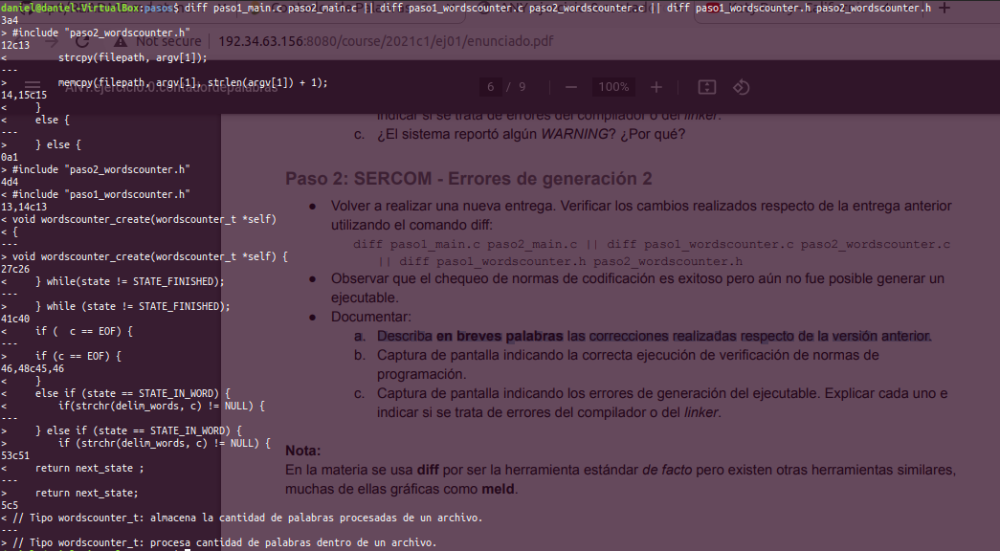
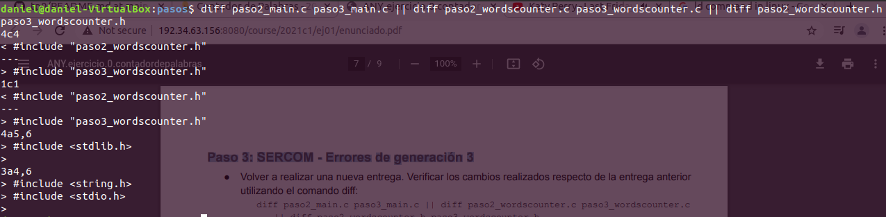
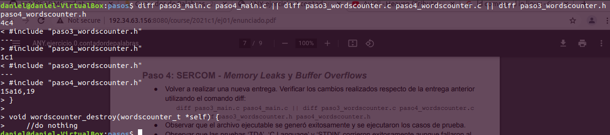

# TP0: Contador de Palabras #
**Autor: Daniel Alejandro Lovera López**  
**N° padrón: 103442**  
**[https://github.com/DanieLovera/tp0](https://github.com/DanieLovera/tp0)**  

---
### INTRODUCCION ###  

- [x] Paso 0
- [x] Paso 1
- [x] Paso 2
- [x] Paso 3
- [x] Paso 4
- [ ] Paso 5
- [ ] Paso 6

---
### DESARROLLO ###   
En esta sección se detallan los pasos seguidos durante el desarrollo del trabajo.

### Paso 0: Entorno de Trabajo ###  
Se crea un programa simple que muestra el mensaje "Hola Mundo" el cual se ejecuta con y sin valgrind, los resultados obtenidos fueron:

1. **Ejecución sin valgrind**  
  
2. **Ejecución con valgrind**  
  

**Preguntas Teóricas**

**a. ¿Para que sirve Valgrind? ¿Cuales son sus opciones mas comunes?**   
> **Valgrind** es un conjunto de herramientas que pueden ser utilizadas para *debugging* (corrección de errores) o *profiling* (análisis de rendimiento) de un programa, su ejecución en línea de comando es de la forma: valgrind --tool\<toolname> ./programa_ejecutable.  
 
Las herramientas mas comunes son:  

- **Memcheck:** 
Detecta errores relacionados a la memoria. Posiblemente sea la opción mas común pues es la herramienta que se utiliza por defecto cuando se ejecuta un programa  con valgrind y ademas es muy común en C/C++ que los programadores olviden liberar memoria solicitada dinamicamente (problema grave que imposibilita reutilizar estas porciones de memoria mientras el programa se mantenga en ejecución).  

- **Cachegrind:**
Herramienta de profiling que ayuda al programador a conocer como se comportan las memorias caches del procesador en la ejecución de un programa.  

Otras herramientas menos comunes o al menos desconocidas para el autor de este texto son:
- **Callgrind:**
Recolecta información sobre los llamados a funciones en un programa.  
 
- **Helgrind:**
Detecta errores en la ejecución de threads de un programa. 
 
- **DRD:**
Otra opción para detección de errores en threads.  

- **Massif:**
Analiza el uso del Heap (area de memoria dinámica).
  
- **DHAT:**
Es otra herramienta para analizar el Heap.  

**b. ¿Que representa sizeof()? ¿Cual seria el valor de salida de sizeof(char) y sizeof(int)?**  
> **sizeof()** es un operador de C/C++ que permite calcular el tamaño en bytes de los tipos de datos definidos por el lenguaje o por el usuario. El valor de **sizeof(char)** sera 1 (1 byte) y el de **sizeof(int)** dependerá de la arquitectura o del compilador, 
lo mas común es que sea 4 (4 bytes).

**c. ¿El sizeof() de una struct de C es igual a la suma del sizeof() de cada uno de sus elementos?. Justifique mediante un ejemplo.**  
> No necesariamente, en una estructura pueden haber datos de cualquier tipo de primitivo e incluso otra estructura por lo cual el tamaño dependerá de la arquitectura y además de como el compilador decida colocar las variables en memoria, puede tomar la decisión de alinear los datos a posiciones de memoria multiplos de cada tipo de dato y trabajar con *paddings*(desperdicios) lo cual en particular simplificará el código generado por el compilador pues no necesita 
hacer calculos especiales para leer un dato, o podría no alinearlos y trabajar sin *padding* (si la arquitectura lo permite) para ahorrar espacio en memoria. En conclusión el **sizeof** de una estructura depende de varias variables, no es fijo.  

   

Tomando en cuenta el caso del compilador sin compactar los datos, los resultados serían:  

- **sizeof(struct foo)** = (1 + 3 bytes de padding) + 4 + (1 + 3 bytes de padding) = **12**  
La explicación a esto es que un entero no podría ser colocado en la posición de memoria siguiente al char porque deben estar alineados a posiciones de memoria multiplos de 4. Considerando que el char estuviera en la posicion 0, el int debe ir en la posición 4 y dejar el padding en las posiciones 1,2 y 3, el último char tambien deja un padding de 3 bytes.

- **sizeof(struct bar)** = (1 + 1 + 2 bytes de padding) + 4 = **8**  
Este caso es similar al anterior, pero los char a y b se pueden colocar uno al lado de otro y esto desperdiciaría menos memoria que caso anterior.

**d. Investigar la existencia de los archivos estandar: STDIN, STDOUT, STDERR. Explicar brevemente su uso y como redirigirlos en caso de ser necesario (caracteres > y <) y como conectar la salida estándar de un proceso a la entrada estándar de otro con un pipe (caracter |)**  
> Todos los programas que se ejecuten en UNIX's comienzan con 3 canales abiertos para transferencias de datos, es decir uno para la entrada, otro de salida y el último es de salida tambien pero en caso de errores en la ejecución del programa, al término del programa estos canales se cierran automáticamente. Los archivos estandar STDIN, STDOUT, STDERR son descriptores de archivos (son valores de tipo int en C/C++ que sirven como clave para que internamente se reconozca a que tendrá acceso el proceso que se esta ejecutando), estos son estándar porque los valores que se le asignan a cada uno son: STDIN = 0, STDOUT = 1, STDOUT = 2.
Por defecto la entrada estándar representa a los flujos de datos proveniente del teclado y la salida estandár común/errores representa al flujo de datos que se dirige a la pantalla y se utilizan para ingresar datos que pueda requerir un programa o para extraerlos de el.  

Ejemplos de como redirigir los archivos estandar por CLI:

1. **echo "Hola Mundo" > example.txt** 
2. **grep < example "Hola"** 
3. **ls non_existing_command >> error_example.txt**
4. **echo "Hola Mundo" | grep "Hola"**  

### Paso 1: SERCOM - Errores de generación y normas de programación ###
Se entregaron los módulos correspondientes a la primera entrega en el SERCOM, este reportó multiples errores por fallas en compilación y discrepancias con respecto a las normas de cpplint.  

**Documentación de errores**  
Descripción de errores generados por el SERCOM.

**a. Problemas de estilo (cpplint)**  
```  
1.    /task/student//source_unsafe/paso1_wordscounter.c:27:  Missing space before ( in while(  [whitespace/parens] [5]
2.    /task/student//source_unsafe/paso1_wordscounter.c:41:  Mismatching spaces inside () in if  [whitespace/parens] [5]
3.    /task/student//source_unsafe/paso1_wordscounter.c:41:  Should have zero or one spaces inside ( and ) in if  [whitespace/parens] [5]
4.    /task/student//source_unsafe/paso1_wordscounter.c:47:  An else should appear on the same line as the preceding }  [whitespace/newline] [4]
5.    /task/student//source_unsafe/paso1_wordscounter.c:47:  If an else has a brace on one side, it should have it on both  [readability/braces] [5]
6.    /task/student//source_unsafe/paso1_wordscounter.c:48:  Missing space before ( in if(  [whitespace/parens] [5]
7.    /task/student//source_unsafe/paso1_wordscounter.c:53:  Extra space before last semicolon. If this should be an empty statement, use {}  instead.  [whitespace/semicolon] [5]
8.    /task/student//source_unsafe/paso1_main.c:12:  Almost always, snprintf is better than strcpy  [runtime/printf] [4]
9.    /task/student//source_unsafe/paso1_main.c:15:  An else should appear on the same line as the preceding }  [whitespace/newline] [4]
10.   /task/student//source_unsafe/paso1_main.c:15:  If an else has a brace on one side, it should have it on both  [readability/braces] [5]
11.   /task/student//source_unsafe/paso1_wordscounter.h:5:  Lines should be <= 80 characters long  [whitespace/line_length] [2]
    Done processing /task/student//source_unsafe/paso1_wordscounter.c
    Done processing /task/student//source_unsafe/paso1_main.c
    Done processing /task/student//source_unsafe/paso1_wordscounter.h
    Total errors found: 11
```  
Los **problemas encontrados** son bastante descriptivos ya que informan la ruta del archivo que contiene el problema, la línea de código de donde se encuentra y ademas el detalle del mismo. **Ejemplo** de como se lee una línea de error:  
>  ruta_archivo/nombre_archivo.[extensión_archivo]:[línea_código]: [Descripción]  

A continuación se detallan los errores de la forma [**Descripción**/**Código que lo genera**], estos fueron enumerados para mayor claridad:  
1. **Missing space before ( in while( / while(state != STATE_FINISHED)**: Indica la **falta de un espacio** antes del párentesis en el while, por lo cual el código que lo soluciona sería while (state != STATE_FINISHED).  
2. **Mismatching spaces inside () in if / if (  c == EOF) {**: Indica la falta de **paridad** entre los espacios adentro del paréntesis del  if, por lo cual una de las formas de solucionarlo sería if (  c == EOF  ), de forma tal que sean simétricos los espacios en blanco.  
3. **Should have zero or one spaces inside ( and ) in if / (  c == EOF)**: Indica que debe haber **ningún** o a lo sumo **un** espacio dentro del paréntesis del if, por lo cual una forma de solucionarlo sería if (c == EOF).  
4. **An else should appear on the same line as the preceding } / }\n else if (state == STATE_IN_WORD) {**: Indica que **un else debe aparecer** en la misma línea que la llave que lo precede, por lo cual la forma de solucionarlo es } else if (state == STATE_IN_WORD) {, es decir deben estar alineados la llave y el else.  
5. **If an else has a brace on one side, it should have it on both / }\n else if (state == STATE_IN_WORD) {**: Indica que **si un else** tiene una llave de un lado, **entonces** debe tenerlo tambien en el lado opuesto, por lo cual la forma de solucionarlo es igual al anterior (4), ya que en este caso la llave que no empareja es la que precede al else. *Observación: localmente cpplint junto con el script provisto por la cátedra no reconoce este como un error.*  
6. **Missing space before ( in if( / if(strchr(delim_words, c) != NULL)**: Este error es idéntico al (1), con la salvedad de que es un if y no un while, por lo cual la solución es la misma.  
7. **Extra space before last semicolon. If this should be an empty statement, use {}  instead. / return next_state ;**: Indica que hay un espacio extra antes del último punto y coma, por lo cual el código que lo soluciona sería return next_state;  
8. **Almost always, snprintf is better than strcpy  [runtime/printf] / strcpy(filepath, argv[1])**: Indica que la función snprintf es mejor que strcpy, esto es porque strcpy es una función insegura ya que no tiene control de cuantos datos escribe en un buffer. La solución es usar la funcion que recomienda o usar strncpy que soluciona el problema del tamaño del buffer tambien.  
9. **An else should appear on the same line as the preceding } / }\n else {**: Mismo error que el (4).  
10. **If an else has a brace on one side, it should have it on both / }\n else {**: Mismo error que en el (5).  
11. **Lines should be <= 80 characters long / //Tipo wordscounter_t: almacena la cantidad de palabras procesadas de un archivo**: Indica que las líneas de código tienen que contener menos de 81 caracteres. La solución es separar el comentario en dos líneas.  

**b. Problemas de generación del ejecutable**  

``` 
cc -Wall -Werror -pedantic -pedantic-errors -O3 -ggdb -DDEBUG -fno-inline -D _POSIX_C_SOURCE=200809L -Dwrapsocks=1 -std=c11 -o paso1_main.o -c paso1_main.c
paso1_main.c: In function 'main':
1. paso1_main.c:22:9: error: unknown type name 'wordscounter_t'
   22 |         wordscounter_t counter;
      |         ^~~~~~~~~~~~~~
2. paso1_main.c:23:9: error: implicit declaration of function 'wordscounter_create' [-Wimplicit-function-declaration]
   23 |         wordscounter_create(&counter);
      |         ^~~~~~~~~~~~~~~~~~~
3. paso1_main.c:24:9: error: implicit declaration of function 'wordscounter_process' [-Wimplicit-function-declaration]
   24 |         wordscounter_process(&counter, input);
      |         ^~~~~~~~~~~~~~~~~~~~
4. paso1_main.c:25:24: error: implicit declaration of function 'wordscounter_get_words' [-Wimplicit-function-declaration]
   25 |         size_t words = wordscounter_get_words(&counter);
      |                        ^~~~~~~~~~~~~~~~~~~~~~
5. paso1_main.c:27:9: error: implicit declaration of function 'wordscounter_destroy' [-Wimplicit-function-declaration]
   27 |         wordscounter_destroy(&counter);
      |         ^~~~~~~~~~~~~~~~~~~~
make: *** [/task/student/MakefileTP0:144: paso1_main.o] Error 1
```  
En este caso es el compilador o linker los que informan sobrelos errores de una forma similar al cpplint, estos errores muchas veces son autodescriptivos, e indican el archivo que contiene el problema, la línea en que ocurre, en que caracter de la línea ocurre, y si el problema es un error o un warning junto con la descripción del mismo. **Ejemplo** de como se lee una línea de error:  
>  nombre_archivo.[extensión_archivo]:[línea_código]:[número_caracter]:[warning/error]:[Descripción]  

A continuación se detallan los errores, estos fueron enumerados para mayor claridad y no forman parte de la salida orginal.  
1. **unknown type name 'wordscounter_t'**: Indica que el tipo de dato **wordscounter_t** es desconocido, nunca fue definido por lo tanto el compilador no puede saber cuando espacio necesita reservar en el stack y no le sera posible generar código objeto. Este es un error que detecta el compilador.
2. **implicit declaration of function 'wordscounter_create'**: Indica que hay una declaración implicita de la funcion **wordscounter_create**, es decir que no se puede generar código ejecutable porque no le hemos asegurado al compilador la existencia de dicha función. Este es un error que detecta el compilador.  
3. **implicit declaration of function 'wordscounter_process'**: Es el mismo error que en (2).  
4. **implicit declaration of function 'wordscounter_get_words'**: Es el mismo error que en (2) y (3).  
5. **implicit declaration of function 'wordscounter_destroy'**: Es el mismo error que en (2), (3) y (4).  

**c. ¿El sistema reportó algún WARNING? ¿Por qué?**  
[Error] Fallo la compilacion del codigo en 'source_unsafe.zip'. Codigo de error 2
> El sistema no reportó ningún warning, todos fueron errores, sin embargo los errores del 2 al 5 en realidad son warnings que se estan considerando como errores porque así se le indica al compilador que lo haga (**flag Werror**), es decir realmente no serían un inconveniente para que se generará el código objeto, no obstante los warnings son posibles errores en tiempo de ejecución y no es recomendable dejarlos pasar pues es mas fácil corregir errores en compilación que hacerlo con un debugger en ejecución.  

### Paso 2: SERCOM - Errores de generación 2 ###  
Se entregaron los módulos correspondientes a la segunda entrega en el SERCOM, este no reporto errores de estilo por cpplint, pero incrementaron lo errores por parte del compilador.  

**Documentación de errores**  

**a. Descripción de los cambios realizados con respecto a la versión del paso 1.**  
  
**Ejecución del comando diff**  
  
  
  
Se puede observar como en cada archivo .c se incluyeron los .h que contenian las definiciones de funciones requeridas por el compilador, se corrigieron los espacios en blanco extras, adicionalmente se alinearon los else e ifs con sus llaves predecesoras, se redujo la cantidad de carácteres contenidos en el comentario del archivo de cabecera a menos de 81 y se reemplazo la función insegura strcpy por memcpy. Estas modificaciones corrigieron los problemas de estilos reportados por cpplint. **Ejemplo** de como interpretar el comando **diff**:    
> **[num_lineas_archivo1][acción][num_lineas_archivo2]**. Siendo la acción alguno de los siguientes caractéres: **a**(add), **c**(change) o **d**(delete).  
> Entonces la primera indicación del comando diff se leería:  
> Después de la línea 3 del del primer archivo se debe cambiar la función strcpy por memcpy para que ambos archivos sean iguales en la línea 4.  

**b. Correcta ejecución de las normas de programación (cpplint).**  
  
``` 
Done processing /task/student//source_unsafe/paso2_wordscounter.h
Done processing /task/student//source_unsafe/paso2_main.c
Done processing /task/student//source_unsafe/paso2_wordscounter.c
```  
**c. Problemas de generación del ejecutable**  Con respecto al archivo anterior se actualizaron los headers y se incluyeron las librerías que hacian falta en el paso 1. El compilador sugería incluir **stddef.h** para encontrar la definición de **size_t.h** pero **stdlib.h** también la contiene.

```
Compilando el codigo...
cc -Wall -Werror -pedantic -pedantic-errors -O3 -ggdb -DDEBUG -fno-inline -D _POSIX_C_SOURCE=200809L -Dwrapsocks=1 -std=c11 -o paso2_wordscounter.o -c paso2_wordscounter.c
In file included from paso2_wordscounter.c:1:
1. paso2_wordscounter.h:7:5: error: unknown type name 'size_t'
    7 |     size_t words;
      |     ^~~~~~
2. paso2_wordscounter.h:20:1: error: unknown type name 'size_t'
   20 | size_t wordscounter_get_words(wordscounter_t *self);
      | ^~~~~~
3. paso2_wordscounter.h:1:1: note: 'size_t' is defined in header '<stddef.h>'; did you forget to '#include <stddef.h>'?
  +++ |+#include <stddef.h>
    1 | #ifndef __WORDSCOUNTER_H__
4. paso2_wordscounter.h:25:49: error: unknown type name 'FILE'
   25 | void wordscounter_process(wordscounter_t *self, FILE *text_file);
      |                                                 ^~~~
5. paso2_wordscounter.h:1:1: note: 'FILE' is defined in header '<stdio.h>'; did you forget to '#include <stdio.h>'?
  +++ |+#include <stdio.h>
    1 | #ifndef __WORDSCOUNTER_H__
6. paso2_wordscounter.c:17:8: error: conflicting types for 'wordscounter_get_words'
   17 | size_t wordscounter_get_words(wordscounter_t *self) {
      |        ^~~~~~~~~~~~~~~~~~~~~~
In file included from paso2_wordscounter.c:1:
7. paso2_wordscounter.h:20:8: note: previous declaration of 'wordscounter_get_words' was here
   20 | size_t wordscounter_get_words(wordscounter_t *self);
      |        ^~~~~~~~~~~~~~~~~~~~~~
8. paso2_wordscounter.c: In function 'wordscounter_next_state':
paso2_wordscounter.c:30:25: error: implicit declaration of function 'malloc' [-Wimplicit-function-declaration]
   30 |     char* delim_words = malloc(7 * sizeof(char));
      |                         ^~~~~~
9. paso2_wordscounter.c:30:25: error: incompatible implicit declaration of built-in function 'malloc' [-Werror]
10. paso2_wordscounter.c:5:1: note: include '<stdlib.h>' or provide a declaration of 'malloc'
    4 | #include <stdbool.h>
  +++ |+#include <stdlib.h>
    5 |
cc1: all warnings being treated as errors
make: *** [/task/student/MakefileTP0:144: paso2_wordscounter.o] Error 1
```
A continuación se detallan los errores, estos fueron enumerados para mayor claridad y no forman parte de la salida orginal.  
1. **unknown type name 'size_t'**: Indica que el tipo de dato size_t es desconocido, esto es un error que detecta el compilador ya que no puede reservar espacio en memoria para la variable.  
2. **unknown type name 'size_t'**: Es el mismo error que (1), mientras no encuentre una definición seguira ocurriendo.  
3. **'size_t' is defined in header '<stddef.h>'; did you forget to '#include stddef.h'**: En este caso el compilador detecto que se esta haciendo uso de un tipo de dato que se encuentra definido en la libreria **stddef.h** y esta haciendo una forma de recordatorio para que sea incluido.  
4. **unknown type name 'FILE'**: Es el mismo error que (1) pero en este caso el compilador no encuentra la definición de FILE.  
5. **'FILE' is defined in header '<stdio.h>'; did you forget to '#include stdio.h'**: Es la misma sugerencia que (3) pero para el dato **FILE** de la libreria **stdio.h**  
6. **conflicting types for 'wordscounter_get_words'**: Indica un problema en los tipos de datos declarados en la funcion **wordscounter_get_words** en este caso el tipo es el **size_t**, el compilador no conoce el tipo de dato de retorno, el error del punto (1) empezo a aparecer en varias partes del código.
7. **previous declaration of 'wordscounter_get_words' was here**: El compilador esta indicando el lugar en donde se declaro la función con el su llamado en el archivo .c.  
8. **implicit declaration of function 'malloc'**: Indica una declaracion implicita de la función **malloc**, esto es porque no se realizo la declaración de la función y el compilador no tiene asegurada su existencia por lo tanto no compilara el código. Esta siendo considerado como error por el compilador pero es un warning, aunque no le aseguremos la existencia de la función el código podría funcionar y en caso de que realmente no exista una función con esa firma fallar en etapa de **linkeo**.  
9. **incompatible implicit declaration of built-in function 'malloc'**: Indica que la misma función del error (8) genera otro problema, el compilador no sabe si la definición implícita empareja con el tipo de dato al que se quiere asignar (char*) en el momento de retornar. Este igualmente es un warning tratado como error.    
10. **include '<stdlib.h>' or provide a declaration of 'malloc'**: El compilador esta nuevamente sugiriendo que incluyamos la libreria que contiene la declaración de **malloc**.  

### Paso 3: SERCOM - Errores de generación 3 ###  
Se entregaron los módulos correspondientes a la tercera entrega en el SERCOM, y decrementaron los errores del compilador.  

**Documentación de errores**  

**a. Descripción de los cambios realizados con respecto a la versión del paso 2.**  
  
**Ejecución del comando diff**  
  
  
  
Con respecto al archivo anterior se actualizaron los headers y se incluyeron las librerías que hacian falta en el paso 2. El compilador sugería incluir **stddef.h** para encontrar la definición de **size_t.h** pero **stdlib.h** también la contiene.

**b. Problemas de generación del ejecutable**  

```
cc -Wall -Werror -pedantic -pedantic-errors -O3 -ggdb -DDEBUG -fno-inline -D _POSIX_C_SOURCE=200809L -Dwrapsocks=1 -std=c11 -o paso3_wordscounter.o -c paso3_wordscounter.c
cc -Wall -Werror -pedantic -pedantic-errors -O3 -ggdb -DDEBUG -fno-inline -D _POSIX_C_SOURCE=200809L -Dwrapsocks=1 -std=c11 -o paso3_main.o -c paso3_main.c
cc paso3_wordscounter.o paso3_main.o -o tp -lm -Wl,--wrap=send -Wl,--wrap=recv
/usr/bin/ld: paso3_main.o: in function `main':
/task/student/source_unsafe/paso3_main.c:27: undefined reference to `wordscounter_destroy'
collect2: error: ld returned 1 exit status
make: *** [/task/student/MakefileTP0:135: tp] Error 1
```
Solo se reportó un error al momento de generar el ejecutable:  
> **undefined reference to `wordscounter_destroy'**: Indica que no se definio una referencia a la funcion wordscounter_destroy, este es un error en tiempo de linkeo. Esto se puede reconocer por las siguientes formas:  

1. El nombre del problema es una pista para entender que el linker lo generó,ya que indica que no encuentra cual es la dirección de memoria a la cual asignarle los llamados del main.c a esta.  
2. Revisando el proceso de compilación que se llevo acabo, se observa que las primeras 4 líneas corresponden a llamados al compilador para llevar los archivos **paso3_wordscounter.c** y **paso3_main.c** a código objeto por separado (flag **-c**), pero la línea 5 ya es una instrucción diferente, se le pide al compilador que cree un ejecutable linkeando los códigos objetos que recién generó, es por eso que el llamado al linker (**/usr/bin/ld**) genera un error en la función que se definió como ***"main"*** internamente en el código assembly.  
3. El error reportado según el informe lo genera el linker (**error: ld returned 1 exit status**), el código de que devuelve al momento de salir del proceso es 1 de error.  

### Paso 4: SERCOM - Memory Leaks y Buffer Overflows ###  
Se entregaron los módulos correspondientes a la cuarta entrega en el SERCOM, no se encontraron errores de compilación, linkeo o de estilo pero el programa no funciona como debería.

**a. Descripción de los cambios realizados con respecto a la versión del paso 3.**  
  
**Ejecución del comando diff**  
  
  

Con respecto al archivo anterior se actualizaron los headers y se incluyó la definición de la función **wordscounter_destroy**.  

**b. Ejecución con Valgrind de la prueba ‘TDA’.**  

```
[=>] Executando el caso '/task/student//cases/tda' (con valgrind)...
[=>] Command line: /usr/bin/valgrind
                --tool=memcheck
                --leak-check=full --leak-resolution=med --show-reachable=yes
                --trace-children=yes
                --track-fds=yes
                --track-origins=no
                --time-stamp=yes --num-callers=20
                --error-exitcode=42
                --log-file=__valgrind__
                --suppressions=/task/student/suppressions.txt ./tp input_tda.txt

real    0m1.291s
user    0m0.552s
sys     0m0.055s

==00:00:00:00.000 60== Memcheck, a memory error detector
==00:00:00:00.000 60== Copyright (C) 2002-2017, and GNU GPL'd, by Julian Seward et al.
==00:00:00:00.000 60== Using Valgrind-3.15.0 and LibVEX; rerun with -h for copyright info
==00:00:00:00.000 60== Command: ./tp input_tda.txt
==00:00:00:00.000 60== Parent PID: 59
==00:00:00:00.000 60==
==00:00:00:01.228 60==
==00:00:00:01.228 60== FILE DESCRIPTORS: 5 open at exit.
==00:00:00:01.228 60== Open file descriptor 4: input_tda.txt
==00:00:00:01.228 60==    at 0x495FEAB: open (open64.c:48)
==00:00:00:01.228 60==    by 0x48E2195: _IO_file_open (fileops.c:189)
==00:00:00:01.228 60==    by 0x48E2459: _IO_file_fopen@@GLIBC_2.2.5 (fileops.c:281)
==00:00:00:01.228 60==    by 0x48D4B0D: __fopen_internal (iofopen.c:75)
==00:00:00:01.228 60==    by 0x48D4B0D: fopen@@GLIBC_2.2.5 (iofopen.c:86)
==00:00:00:01.228 60==    by 0x109177: main (paso4_main.c:14)
==00:00:00:01.228 60==
==00:00:00:01.228 60== Open file descriptor 3: /task/student/cases/tda/__valgrind__
==00:00:00:01.228 60==    <inherited from parent>
==00:00:00:01.228 60==
==00:00:00:01.228 60== Open file descriptor 2: /task/student/cases/tda/__stderr__
==00:00:00:01.228 60==    <inherited from parent>
==00:00:00:01.228 60==
==00:00:00:01.228 60== Open file descriptor 1: /task/student/cases/tda/__stdout__
==00:00:00:01.228 60==    <inherited from parent>
==00:00:00:01.228 60==
==00:00:00:01.228 60== Open file descriptor 0: /task/student/cases/tda/__stdin__
==00:00:00:01.228 60==    <inherited from parent>
==00:00:00:01.228 60==
==00:00:00:01.228 60==
==00:00:00:01.228 60== HEAP SUMMARY:
==00:00:00:01.228 60==     in use at exit: 1,977 bytes in 216 blocks
==00:00:00:01.228 60==   total heap usage: 218 allocs, 2 frees, 10,169 bytes allocated
==00:00:00:01.228 60==
==00:00:00:01.231 60== 472 bytes in 1 blocks are still reachable in loss record 1 of 2
==00:00:00:01.231 60==    at 0x483B7F3: malloc (in /usr/lib/x86_64-linux-gnu/valgrind/vgpreload_memcheck-amd64-linux.so)
==00:00:00:01.231 60==    by 0x48D4AAD: __fopen_internal (iofopen.c:65)
==00:00:00:01.231 60==    by 0x48D4AAD: fopen@@GLIBC_2.2.5 (iofopen.c:86)
==00:00:00:01.231 60==    by 0x109177: main (paso4_main.c:14)
==00:00:00:01.231 60==
==00:00:00:01.231 60== 1,505 bytes in 215 blocks are definitely lost in loss record 2 of 2
==00:00:00:01.231 60==    at 0x483B7F3: malloc (in /usr/lib/x86_64-linux-gnu/valgrind/vgpreload_memcheck-amd64-linux.so)
==00:00:00:01.231 60==    by 0x109301: wordscounter_next_state (paso4_wordscounter.c:35)
==00:00:00:01.231 60==    by 0x1093B5: wordscounter_process (paso4_wordscounter.c:30)
==00:00:00:01.231 60==    by 0x109197: main (paso4_main.c:24)
==00:00:00:01.231 60==
==00:00:00:01.231 60== LEAK SUMMARY:
==00:00:00:01.231 60==    definitely lost: 1,505 bytes in 215 blocks
==00:00:00:01.231 60==    indirectly lost: 0 bytes in 0 blocks
==00:00:00:01.231 60==      possibly lost: 0 bytes in 0 blocks
==00:00:00:01.231 60==    still reachable: 472 bytes in 1 blocks
==00:00:00:01.231 60==         suppressed: 0 bytes in 0 blocks
==00:00:00:01.231 60==
==00:00:00:01.231 60== For lists of detected and suppressed errors, rerun with: -s
==00:00:00:01.231 60== ERROR SUMMARY: 1 errors from 1 contexts (suppressed: 0 from 0)
```
  
Valgrind detectó 218 alocaciones de memoria dinámica de las cuales libero 2 y se perdieron 216 de esas peticiones, de las cuales 215 fueron perdidas definitivas y 1 es aun alcanzable, a continuación se detallan estos errores:    

**Bloques de memoria aún alcanzables**
```
==00:00:00:01.231 60== 472 bytes in 1 blocks are still reachable in loss record 1 of 2
==00:00:00:01.231 60==    at 0x483B7F3: malloc (in /usr/lib/x86_64-linux-gnu/valgrind/vgpreload_memcheck-amd64-linux.so)
==00:00:00:01.231 60==    by 0x48D4AAD: __fopen_internal (iofopen.c:65)
==00:00:00:01.231 60==    by 0x48D4AAD: fopen@@GLIBC_2.2.5 (iofopen.c:86)
==00:00:00:01.231 60==    by 0x109177: main (paso4_main.c:14)
==00:00:00:01.231 60==
```
> El primer error registrado indica que se perdieron 472 bytes de memoria que corresponden a un único bloque de memoria (correspondientes a una única petición de memoria) y aún son alcanzables, es decir, es memoria que el programador pudo liberar pues en alguna parte del programa hay un puntero que contiene la referencia a este bloque. Valgrind no puede indicar quien la contiene pero si indica el momento en el cual se solicito la memoria y fue en el archivo **paso4_main.c** en la linea **4**. En este caso es memoria que quedo atrapada por olvidar liberar un recurso abierto. 

**Bloques de memoria de pérdida definitiva**

```
==00:00:00:01.231 60== 1,505 bytes in 215 blocks are definitely lost in loss record 2 of 2
==00:00:00:01.231 60==    at 0x483B7F3: malloc (in /usr/lib/x86_64-linux-gnu/valgrind/vgpreload_memcheck-amd64-linux.so)
==00:00:00:01.231 60==    by 0x109301: wordscounter_next_state (paso4_wordscounter.c:35)
==00:00:00:01.231 60==    by 0x1093B5: wordscounter_process (paso4_wordscounter.c:30)
==00:00:00:01.231 60==    by 0x109197: main (paso4_main.c:24)
```
> El segundo error que se registró indica que se perdieron 1505 bytes en 215 peticiones de memoria y se perdieron definitivamente, es decir, en el programa no quedan punteros referenciando a ningún bloque de estos. Es un error mas grave que el anterior y el momento en que se solicita la memoria es en la función **wordscounter_next_state** correspondiente al archivo **paso4_wordscounter.c** en  la línea **35**  

**c. Ejecución con Valgrind de la prueba ‘Long Filename’.**
```
[=>] Executando el caso '/task/student//cases/nombre_largo' (con valgrind)...
[=>] Command line: /usr/bin/valgrind
                --tool=memcheck
                --leak-check=full --leak-resolution=med --show-reachable=yes
                --trace-children=yes
                --track-fds=yes
                --track-origins=no
                --time-stamp=yes --num-callers=20
                --error-exitcode=42
                --log-file=__valgrind__
                --suppressions=/task/student/suppressions.txt ./tp input_extremely_long_filename.txt

real    0m1.225s
user    0m0.526s
sys     0m0.053s

**00:00:00:01.154 48** *** memcpy_chk: buffer overflow detected ***: program terminated
==00:00:00:00.008 48== Memcheck, a memory error detector
==00:00:00:00.008 48== Copyright (C) 2002-2017, and GNU GPL'd, by Julian Seward et al.
==00:00:00:00.008 48== Using Valgrind-3.15.0 and LibVEX; rerun with -h for copyright info
==00:00:00:00.008 48== Command: ./tp input_extremely_long_filename.txt
==00:00:00:00.008 48== Parent PID: 47
==00:00:00:00.008 48==
**00:00:00:01.154 48** *** memcpy_chk: buffer overflow detected ***: program terminated
==00:00:00:01.154 48==    at 0x483E9CC: ??? (in /usr/lib/x86_64-linux-gnu/valgrind/vgpreload_memcheck-amd64-linux.so)
==00:00:00:01.154 48==    by 0x4843C0A: __memcpy_chk (in /usr/lib/x86_64-linux-gnu/valgrind/vgpreload_memcheck-amd64-linux.so)
==00:00:00:01.154 48==    by 0x109168: memcpy (string_fortified.h:34)
==00:00:00:01.154 48==    by 0x109168: main (paso4_main.c:13)
==00:00:00:01.181 48==
==00:00:00:01.181 48== FILE DESCRIPTORS: 4 open at exit.
==00:00:00:01.181 48== Open file descriptor 3: /task/student/cases/nombre_largo/__valgrind__
==00:00:00:01.181 48==    <inherited from parent>
==00:00:00:01.181 48==
==00:00:00:01.181 48== Open file descriptor 2: /task/student/cases/nombre_largo/__stderr__
==00:00:00:01.181 48==    <inherited from parent>
==00:00:00:01.181 48==
==00:00:00:01.181 48== Open file descriptor 1: /task/student/cases/nombre_largo/__stdout__
==00:00:00:01.181 48==    <inherited from parent>
==00:00:00:01.181 48==
==00:00:00:01.181 48== Open file descriptor 0: /task/student/cases/nombre_largo/__stdin__
==00:00:00:01.181 48==    <inherited from parent>
==00:00:00:01.181 48==
==00:00:00:01.181 48==
==00:00:00:01.181 48== HEAP SUMMARY:
==00:00:00:01.181 48==     in use at exit: 0 bytes in 0 blocks
==00:00:00:01.181 48==   total heap usage: 0 allocs, 0 frees, 0 bytes allocated
==00:00:00:01.181 48==
==00:00:00:01.181 48== All heap blocks were freed -- no leaks are possible
==00:00:00:01.181 48==
==00:00:00:01.181 48== For lists of detected and suppressed errors, rerun with: -s
==00:00:00:01.181 48== ERROR SUMMARY: 0 errors from 0 contexts (suppressed: 0 from 0)
```
Valgrind detectó un unico error de memoria, en este caso no es por pérdidas sino por un buffer overflow, la ultima función que se ejecutó antes del problema fue memcpy la cual copia una cantidad de datos exacta desde un buffer fuente a un destino pero, si el tamaño del buffer destino es menor al del buffer fuente memcpy no lo controla, el comportamiento es indefinido. En este caso se esta intentando copiar algo muy grande en un buffer muy pequeño y se produce un overflow, sin embargo este problema no lo detecta unicamente valgrind y tambien falla la ejecución sin valgrind, de hecho el el registro se observa como se informa el error **memcpy_chk: buffer overflow detected** antes de comenzar siquiera a correr valgrind y por alguna raznó continua la ejecución y valgrind lo detecta tambien.  
  
**Error memcpy**  
```
**00:00:00:01.154 48** *** memcpy_chk: buffer overflow detected ***: program terminated
==00:00:00:01.154 48==    at 0x483E9CC: ??? (in /usr/lib/x86_64-linux-gnu/valgrind/vgpreload_memcheck-amd64-linux.so)
==00:00:00:01.154 48==    by 0x4843C0A: __memcpy_chk (in /usr/lib/x86_64-linux-gnu/valgrind/vgpreload_memcheck-amd64-linux.so)
==00:00:00:01.154 48==    by 0x109168: memcpy (string_fortified.h:34)
==00:00:00:01.154 48==    by 0x109168: main (paso4_main.c:13)
```

d. **¿Podría solucionarse este error utilizando la función strncpy? ¿Qué hubiera ocurrido con la ejecución de la prueba?**  
No, sería lo mismo pues el problema no es la función memcpy sino la cantidad de datos que queremos copiar del buffer mas grande al mas pequeño, si limitamos este valor al tamaño del buffer mas chico entonces el problema del overflow desaparecería porque se truncarían los datos que copia del buffer fuente, claro esta que el comportamiento de la función sería incorrecto pues del nombre del archivo depende la apertura de un recurso. La diferencia entre memcpy y strncpy es que strncpy completará con ceros el buffer destino en caso de que el buffer destino sea mas pequeño y memcpy no lo hará, se limitará a copiar exactamente lo que le pidamos, para este problema que enfrentamos no habría diferencia alguna pues precisamente el buffer destino es mas grande.  

e. **Explicar de qué se trata un segmentation fault y un buffer overflow**  
- **Segmentation fault**: La memoria suele dividirse en segmentos y páginas, cada proceso que ejecuta el procesador tiene reservada uno o varios de estos segmentos o páginas. Segmentation fault ocurre cuando un proceso esta intentando acceder a un segmento de memoria que no le corresponde ya que no fue reservado para el, suele ser muy común cuando trabajamos con buffers ya que muchas veces podemos pasar los límites de estos hasta llegar a pisar la dirección de memoria que contiene la dirección de retorno de la rutina que se esta ejecutando causando que al retornar el programa vuelva a una dirección de memoria que muy probablemente sea basura o simplemente este ocupada por otro programa que se este ejecutando.  
- **Buffer overflow**: Ocurre cuando nos pasamos de los límites de un buffer con el que estemos trabajando, este problema no necesariamente causara la interrumpción abrupta del programa que se esta ejecutando(creería depende tambien depende de si se desactiva la protección que el compilador le da al stack al compilar un programa). Los datos del programa se pueden corromper sin que este se entere.  


