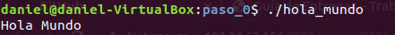
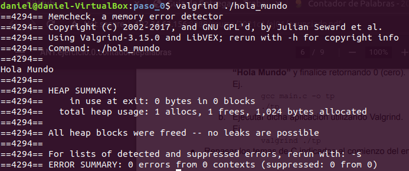
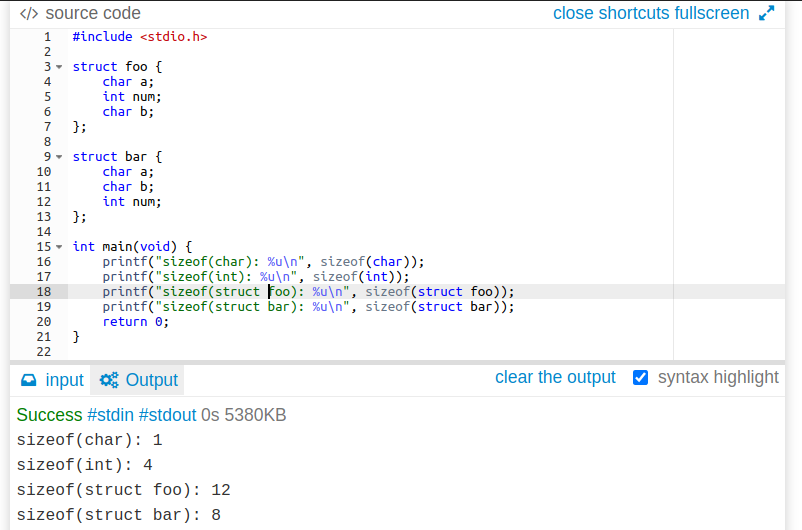

# Tp0: Contador de Palabras #
**Autor: Daniel Alejandro Lovera López**  
**N° padrón: 103442**  
**[https://github.com/DanieLovera/tp0](https://github.com/DanieLovera/tp0)**  

---
### INTRODUCCION ###  

- [x] Paso 0
- [ ] Paso 1
- [ ] Paso 2

---
### DESARROLLO ###  

### Paso 0: Entorno de Trabajo ###  
Se crea un programa simple que muestra el mensaje "Hola Mundo" el cual se ejecuta con y sin valgrind, los resultados obtenidos fueron:

1. **Ejecución sin valgrind**  
  
2. **Ejecución con valgrind**  
  

**Preguntas Teóricas**

**a. ¿Para que sirve Valgrind? ¿Cuales son sus opciones mas comunes?**   
 **Valgrind** es un conjunto de herramientas que pueden ser utilizadas para *debugging* (corrección de errores) o *profiling* (análisis de rendimiento) de un programa y su ejecucion en línea de comando es de la forma: valgrind --tool<toolname> ./programa_ejecutable.  
 Las herramientas mas comunes son:  

- **Memcheck:** 
> Detecta errores relacionados a la memoria. Posiblemente sea la opción mas común pues es la herramienta que se utiliza por defecto cuando se ejecuta un programa  con valgrind y ademas es muy común en C/C++ que los programadores olviden liberar memoria solicitada dinamicamente (problema grave que imposibilita reutilizar estas porciones de memoria mientras el programa se mantenga en ejecución).  

- **Cachegrind:**
> Herramienta de profiling que ayuda al programador a conocer como comportan las memorias caches del procesador en la ejecución de un programa.  

Otras herramientas menos comunes o al menos desconocidas para el autor de este texto son:
- **Callgrind:**
> Recolecta información sobre los llamados a funciones en un programa.  
 
- **Helgrind:**
> Detecta errores en la ejecución de threads de un programa. 
 
- **DRD:**
> Otra opción para detección de errores en threads.  

- **Massif:**
> Analiza el uso del Heap (area de memoria dinámica).
  
- **DHAT:**
> Es otra herramienta para analizar el Heap.  

**b. ¿Que representa sizeof()? ¿Cual seria el valor de salida de sizeof(char) y sizeof(int)?**  
**sizeof()** es un operador de C/C++ que permite calcular el tamaño en bytes de los tipos de datos definidos por el lenguaje o por el usuario. El valor de **sizeof(char)** sera 1 (1 byte) y el de **sizeof(int)** dependerá de la arquitectura o del compilador, 
lo mas común es que sea 4 (4 bytes).

**c. ¿El sizeof() de una struct de C es igual a la suma del sizeof() de cada uno de sus elementos?. Justifique mediante un ejemplo.**  
No necesariamente, en una estructura pueden haber datos de cualquier tipo de primitivo e incluso otra estructura por lo cual el tamaño dependerá de la arquitectura y además de como el compilador decida colocar las variables en memoria, puede tomar la decisión de alinear los datos a posiciones de memoria multiplos de cada tipo de dato y trabajar con *paddings*(desperdicios) lo cual en particular simplificará el código generado por el compilador pues no necesita 
hacer calculos especiales para leer un dato, o podría no alinearlos y trabajar sin *padding* (si la arquitectura lo permite) para ahorrar espacio en memoria. En conclusión el **sizeof** de una estructura depende de varias variables, no es fijo.  
   

Tomando en cuenta el caso del compilador sin compactar los datos, los resultados serían:  

- **sizeof(foo)** = (1 + 3 bytes de padding) + 4 + (1 + 3 bytes de padding) = **12**  
La explicación a esto es que un entero no podría ser colocado en la posición de memoria siguiente al char porque deben estar alineados a posiciones de memoria multiplos de 4. Considerando que el char estuviera en la posicion 0, el int debe ir en la posicion 4 y dejar el padding en las posiciones 1,2 y 3, el último char tambien deja un padding de 3 bytes.

- **sizeof(bar)** = (1 + 1 + 2 bytes de padding) + 4 = **8**  
Este caso es similar al anterior, pero los char a y b se pueden colocar uno al lado de otro y esto desperdiciaría menos memoria que caso anterior.

**d. Investigar la existencia de los archivos estandar: STDIN, STDOUT, STDERR. Explicar brevemente su uso y como 
redirigirlos en caso de ser necesario (caracteres > y <) y como conectar la salida estándar de un proceso a la
entrada estadar de otro con un pipe (caracter |)**  

Todos los programas que se ejecuten en UNIX's comienzan con 3 canales abiertos para transferencias de datos, es decir
unos para la entrada otro de salida y el ultimo es de salida tambien pero en caso de errores en la ejecución 
del programa, al termino del programa estos canales se cierran automaticamente. Los archivos estandar STDIN, STDOUT, STDERR 
son descriptores de archivos (son valores de tipo int en C/C++ que sirven como clave para que internamente se reconozca a que tendra 
acceso el proceso que se esta ejecutando), estos son estandar porque los valores que se le asignan a cada uno 
son: STDIN = 0, STDOUT = 1, STDOUT = 2).
Por defecto la entrada estandar representa a los flujos de datos proveniente del teclado y la salida estandar 
comun/errores representa al flujo de datos que se dirige a la pantalla y se utilizan para ingresar datos que pueda 
requerir un programa o para extraerlos de el.  

Ejemplos de como redirigir los archivos estandar por CLI:

1. echo "Hola Mundo" > example.txt 
2. grep < example "Hola"
3. ls non_existing_command >> error_example.txt
4. echo "Hola Mundo" | grep "Hola"
